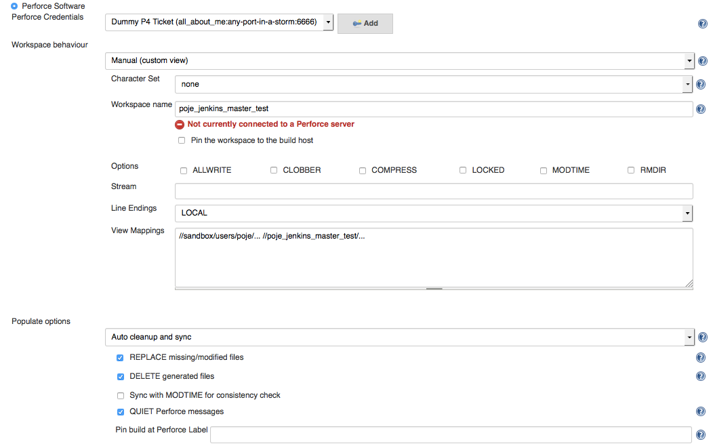

# Usage Notes and Tips

## Seeding a Perforce Configuration

Take a sample Perforce configuration:



The underlying Jenkins XML representation for this can be found by browsing to the Jenkins project and appending
the string '/config.xml' to the URL.  For this project, it looks like this:

````
<?xml version='1.0' encoding='UTF-8'?>
<project>
  <actions/>
  <description></description>
  <keepDependencies>false</keepDependencies>
  <properties/>
  <scm class="org.jenkinsci.plugins.p4.PerforceScm" plugin="p4@1.3.6-ADOBE-SNAPSHOT">
    <credential>95f4c776-2e2c-4a58-a41c-0af7e23bad31</credential>
    <workspace class="org.jenkinsci.plugins.p4.workspace.ManualWorkspaceImpl">
      <charset>none</charset>
      <pinHost>false</pinHost>
      <name>poje_jenkins_master_test</name>
      <spec>
        <allwrite>false</allwrite>
        <clobber>false</clobber>
        <compress>false</compress>
        <locked>false</locked>
        <modtime>false</modtime>
        <rmdir>false</rmdir>
        <streamName></streamName>
        <line>LOCAL</line>
        <view>//sandbox/users/poje/... //poje_jenkins_master_test/...</view>
      </spec>
    </workspace>
    <populate class="org.jenkinsci.plugins.p4.populate.AutoCleanImpl">
      <have>true</have>
      <force>false</force>
      <modtime>false</modtime>
      <quiet>true</quiet>
      <pin></pin>
      <replace>true</replace>
      <delete>true</delete>
    </populate>
  </scm>
````

Based on the XML, a Jenkins "seed" project can be created to replicate this by using the following groovy code using the [Job-DSL-Plugin](https://wiki.jenkins-ci.org/display/JENKINS/Job+DSL+Plugin).

When the project is built, it will create a new project named "auto-created-project" that will contains the same SCM perforce configuration as the original "Dummy Test Project"


````
import org.apache.commons.lang.SystemUtils

// Start Job creation.
job("auto-created-project") {
	concurrentBuild(allowConcurrentBuild = false)
	disabled(shouldDisable = true)
	label("Win")
	logRotator(daysToKeep = 7, numToKeep = 10, artifactDaysToKeep = 7, artifactNumToKeep = 10)
    
	configure { project ->
		project.remove(project / scm) // remove the existing 'scm' element
		
		project / scm(class: 'org.jenkinsci.plugins.p4.PerforceScm') {
		
			credential 'fe40e7cf-902b-4de8-ab6a-b7f0cb1a9f6f'

			workspace(class :'org.jenkinsci.plugins.p4.workspace.ManualWorkspaceImpl') {
				charset 'none'
				pinHost 'false'
				name 'poje_jenkins_master_test'
          
				spec {
					allwrite 'false'
					clobber 'false'
					compress 'false'
					locked 'false'
					modtime 'false'
					rmdir 'false'
					streamName ''
					line 'LOCAL'
					view '//sandbox/users/poje/... //poje_jenkins_master_test/...'
				}
				
				populate(class:'org.jenkinsci.plugins.p4.populate.AutoCleanImpl') {
					have 'true'
					force 'false'
					modtime 'false'
					quiet 'true'
					pin ''
					replace 'true'
					delete 'true'
				}
			}
		}
	}
}
````

### References

Generic documentation about the DSL Configuration block is located [here](https://github.com/jenkinsci/job-dsl-plugin/wiki/The-Configure-Block).