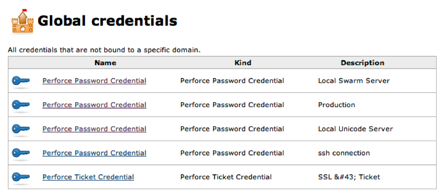
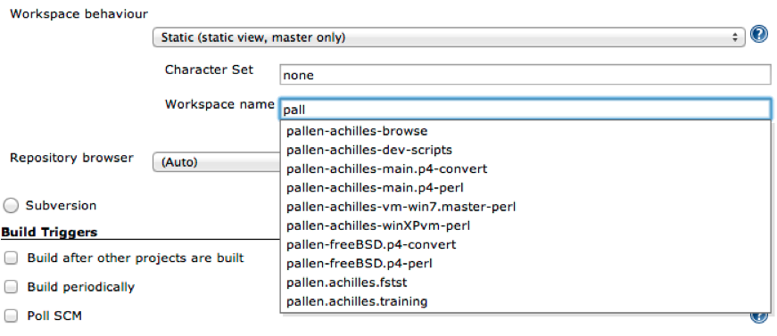
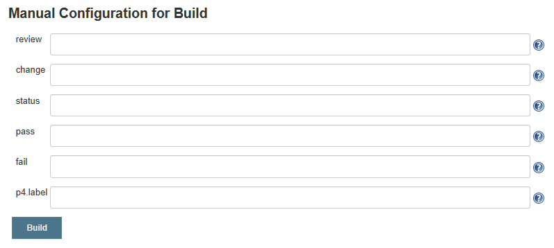
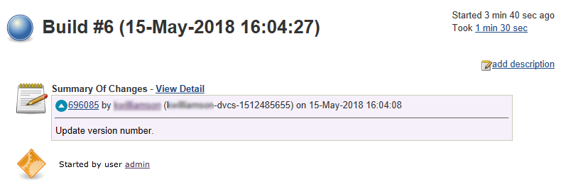
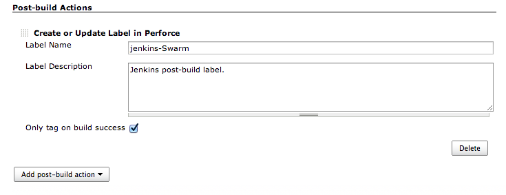
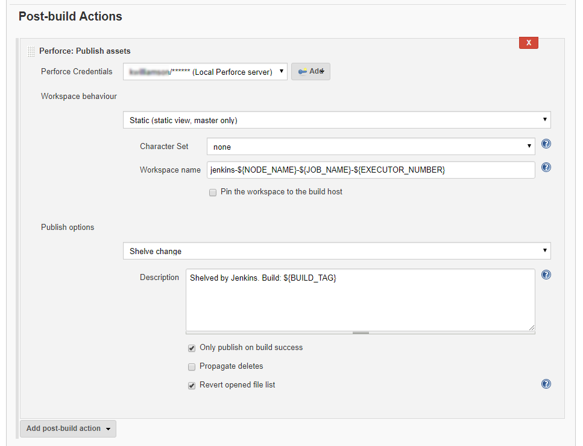
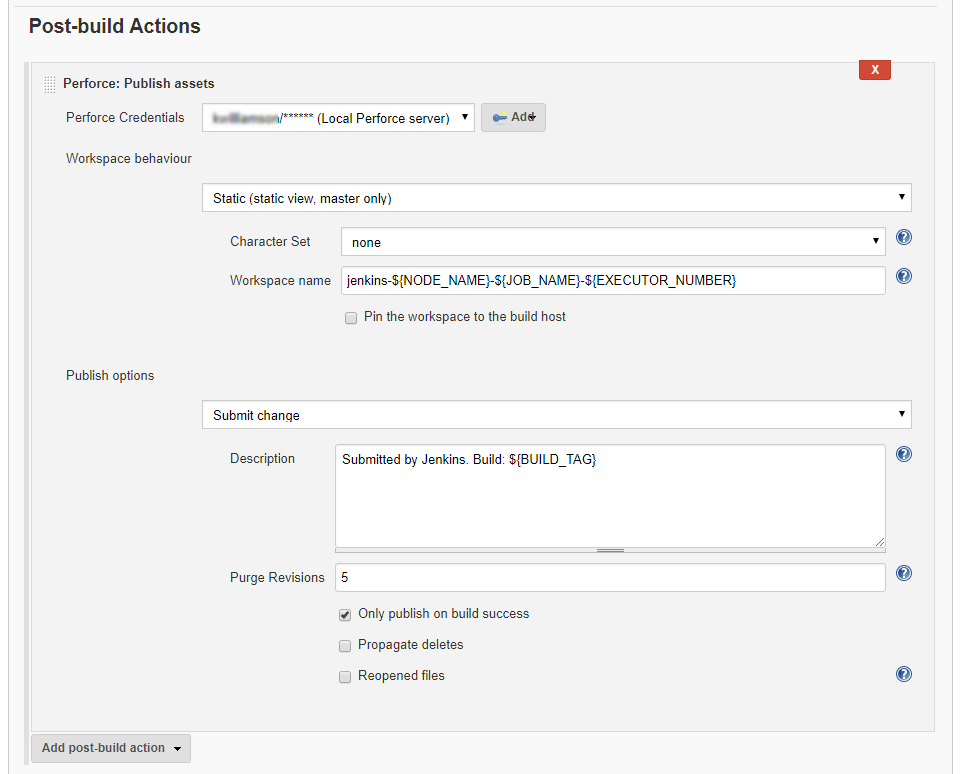
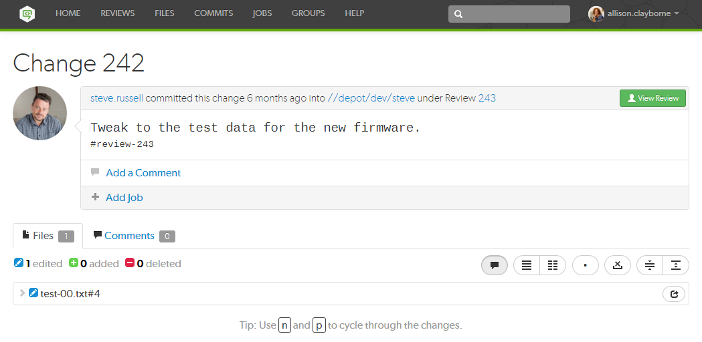

# p4-jenkins

## Requirements

* Jenkins 1.509 or greater.
* P4D 12.1 or greater.
* Minimum Perforce Protection of 'open' for the Jenkins user. 
If you wish to use the Review Build feature you will need Swarm.  Swarm 2014.2 or greater is required to support Jenkins authentication.

## Install

1. Open Jenkins in a browser; e.g. http://jenkins_host:8080
2. Browse to 'Manage Jenkins' --> 'Manage Plugins' and Select the 'Available' tab.
3. Find the 'P4 Plugin' or use the Filter if needed
4. Check the box and press the 'Install without restart' button

If you are unable to find the plugin, you may need to refresh the Update site.

1. Select the 'Advanced' tab (under 'Manage Plugins')
2. Press the 'Check now' button at the bottom of the page.
3. When 'Done' go back to the update centre and try again.

## Building

To build the plugin and run the tests use the following:

	mvn package
  
Note: for the tests to run you must have p4d in your PATH, to skip tests use the -DskipTests flag.

## Manual install

1. Open Jenkins in a browser; e.g. http://jenkins_host:8080
2. Browse to 'Manage Jenkins' --> 'Manage Plugins’ and Select the 'Advanced' tab.
3. Press the 'Choose File' button under the 'Upload Plugin' section
4. Find the location of the 'p4.hpi' file and Select Upload
5. Choose the 'Download now and install after restart' button (this might be different on the newer version)

## Credentials

The plugin makes use of the Jenkins Credential store making it easier to manage the Perforce Server connection for multiple Jenkins jobs.  Perforce Server credentials must be added to the Global or a user defined domain, using one of the two supported Perforce Credentials: 'Perforce Password Credential' or 'Perforce Ticket Credential'.



To add a Perforce Credential:

1. Navigate to the Jenkins Credentials page (select 'Credentials' on the left hand side)
2. Select 'Global credentials' (or add domain if needed)
3. Select 'Add Credentials' from the left hand side
4. Choose 'Perforce Password Credential' from the 'Kind' drop-down select
5. Enter a Description e.g. local test server
6. Enter the P4Port e.g. localhost:1666
7. Enter a valid username and password
8. Press the 'Test Connection' button (you should see Success)
9. Click 'Save' to save.
 


The Perforce Ticket Credential supports using a ticket file (such as the default P4TICKETS file) or a ticket value (returned by the command p4 login -p).  If Ticket authentication is used for remote builds the Ticket must be valid for the remote host (either login on the remote host or use p4 login -a). 

All Perforce Credential types support SSL for use on Secured Perforce Servers; to use just check the SSL box and provide the Trust fingerprint.


## Workspaces

Perforce workspaces are configured on the Jenkin Job configuration page and support the following behaviours:

* Static

The workspace specified must have been previously defined.  The Perforce Jenkins user must either own the workspace or the spec should be unlocked allowing it to make edits.  The workspace View remains static, but Jenkins will update other fields such as the workspace root and clobber option. 



* Spec File

The workspace configuration is loaded from a depot file containing a Client workspace Spec (same output as p4 client -o and the Spec depot '.p4s' format).  The name of the workspace must match the name of the Client workspace Spec.


* Manual

This allows the specified workspace to be created (if it does not exist) or update the spec by setting the various options.  Jenkins will fill out the workspace root and may override the clobber option.


* Template & Stream

In this mode the workspace View is generated using the specified template workspace or stream.  The name of the workspace is generated using the Workspace Name Format field and makes it an ideal choice for matrix builds.


## Populating

Perforce will populate the workspace with the file revisions needed for the build, the way the workspace is populated is configured on the Jenkin Job configuration page and support the following behaviours:

* Automatic cleanup and sync

Perforce will revert any shelved or pending files from the workspace; this includes the removal of files that were added by the shelved or pending change.  Depending on the two check options boxes Perforce will then clean up any extra files or restore any modified or missing files.  Finally, Perforce will sync the required file revisions to the workspace populating the 'have' table.


* Forced clean and sync

Perfore will remove all files from under the workspace root, then force sync the required file revisions to the workspace.  If the populating the 'have' table options is enabled then the 'have' list will be updated.  


This method is not recommended as the cost of IO resources on server and client are high.  Apart from exceptional circumstances the Automatic cleanup and sync option will produce the same result.

* Sync only

Perforce will not attempt to cleanup the workspace; the sync operation will update all files (as CLOBBER is set) to the required set of revisions.  If the populating the 'have' table options is enabled then the 'have' list will be updated.


## Building

Building a Jenkins Job can be triggered using the SCM polling option, Build Now button or calling the build/ URL endpoint.

To enable SCM polling, check the 'Poll SCM' option and provide a Schedule using the Cron format.  For example every 10 minutes Monday to Friday, the 'H' is a time offset (calculated using a Hash of the Job name).


To build immediately select the Build now button...


Or use the call the build/ URL endpoint e.g. http://jenkins_host:8080/job/myJobID/build

(where myJobID is the name of your job and jenkins_host the name or IP address of your Jenkins server).

### Building at a change

A Jenkins job can build at any point in the codes history, identified by a Perforce change or label.

The Jenkins job can be _pinned_ to a Perforce change or label by setting the `Pin build at Perforce Label` field under the Populate options.  Any time the Jenkins job is trigged, it will only build upto the pinned point.

Alternativly, a change or label can be passed using the `Build Review` paramiters or URL end point (see the _Build Review_ chapter for details) 


## Filtering

When polling is used, changes can be filtered to not trigger a build; the filters are configured on the Jenkin Job configuration page and support the following types:

* Exclude changes from user

Changes owned by the Perforce user specified in the filter will be excluded.


* Exclude changes from Depot path

Changes where all the file revision's path starting with the String specified in the filter will be excluded.


For example, with a Filter of "//depot/main/tests":

Case A (change will be filtered):

    Files:
        //depot/main/tests/index.xml
        //depot/main/tests/001/test.xml
        //depot/main/tests/002/test.xml

Case B (change will not be filtered, as build.xml is outside of the filter):

    Files:
        //depot/main/src/build.xml
        //depot/main/tests/004/test.xml
        //depot/main/tests/005/test.xml
 
## Review

The plugin supports a Build Review Action with a review/build/ URL endpoint.  Parameters can be passed informing Jenkins of Perforce shelf to unshelve and changelist to sync to.  There are also Pass/Fail callback URLs for use with Swarm.

An example URL that would build the review in the shelved change 23980:

http://jenkins_host:8080/job/myJobID/review/build?status=shelved&review=23980

The Build Review Action support the following parameters:
* status (shelved or submitted)
* review (the pending shelved change)
* change (the submitted change)
* label (a Perforce label, instead of change)
* pass (URL to call after a build succeeded)
* fail (URL to call after a build failed)

*Please note these paramiter are stored in the Environment and can be used with variable expansion e.g. ${label}; for this reason please avoid these names for slaves and matrix axis.*

The Build Review Action can be invoked manually from within Jenkins by selecting the Build Review button on the left hand side.  This provides a form to specify the parameters for build.




## Changes Summary

After a build Jenkins provides the ability to see the details of a build.  Select the build of interest from the Build History on the left hand side.  You then get a Perforce change summary for the build and clicking on the View Detail link for specific files.



Detailed view...


## Tagging Builds

Jenkins can tag builds automatically as a Post Build Action or allow manual tagging of a build.  The Tags are stored in Perforce as Automatic Labels with the label view based on the workspace at the time of tagging.

Tagging with Post Build Action



Manual Tagging

* Select the build that you wish to tag from the project page.


* Click on the 'Label This Build' link on the left hand panel, if the build has already been tagged the link will read 'Perforce Label'.


* Update the label name and description as required and click 'Label Build' to add the label to Perforce.


* Once the build is labeled you will see the label details appear in a table above.  New labels can be added to the same build or labels can be updated by providing the same label name.

## Publishing Build assets

Jenkins can automatically shelve or submit build assets to Perforce.  Select the 'Add post-build action' and select the 'Perforce: Publish assets' from the list.  Select the Credentials and Workspace options, you can connect to a different Perforce server if required.  Update the description if required, ${variables} are expanded.

Shelving with Post Build Action



Submitting with Post Build Action



## Repository Browsing

Repository browsing allows Jenkins to use an external browser, like Swarm, P4Web, etc... to navigate files and changes associated with a Jenkins build.

To enable the feature select the Repository browser from the Job Configuration page and provide the full URL to the browser.


Link to change in Swarm


 
## Troubleshooting

### Connection issues


**Error**: Setting up a SSL Credentials connection to Perforce.

```
Unable to connect: com.perforce.p4java.exception.ConnectionException:
Error occurred during the SSL handshake:
invalid SSL session
```

**Solution**: Due to current US export control restrictions for some countries, the standard JDK package only comes with 128 bit encryption level cyphers. In order to use P4Java to connect to an SSL-enabled Perforce server, those living in eligible countries may download the unlimited strength JCE (Java Cryptography Extension) package and replace the current default cryptography jar files on the build server with the unlimited strength files. 

The libraries can be downloaded from:

   http://www.oracle.com/technetwork/java/javase/downloads/jce-7-download-432124.html

Installation instructions can be found in the file 'README.txt' in the JCE download.

---

**Error**: Perforce login error part way through a build with an Edge/Commit setup.

```
Perforce password (P4PASSWD) invalid or unset.
- no such file(s).
ERROR: Unable to update workspace:
com.perforce.p4java.exception.AccessException: Perforce password (P4PASSWD) invalid or unset.
```

**Solution**: The following configurables must be set to allow the Edge to forward the login information to the Commit server.  

`p4 configure set cluster.id=myID`
`p4 configure set myEdge#rpl.forward.login=1`


## Release notes

### Release 1.2.6 (major features/fixes)


[@15347](swarm.workshop.perforce.com/changes/15347) - Moved the Expand setup into labelBuild() in order to pass listener (and not null) to getEnvironment().


[@15345](swarm.workshop.perforce.com/changes/15345) - Fixed issue with workflow-plugin when setting changelog to false.


### Release 1.2.6 (major features/fixes)

[@15293](swarm.workshop.perforce.com/changes/15293) - Add retry attempts to Perforce Tasks. If a task fails due to an exception then the task will retry based on the value specified in the connection Credential.


[@15249](swarm.workshop.perforce.com/changes/15249) - Null protection if Label Owner is not set.  Fall back to “unknown” for user.


[@15138](swarm.workshop.perforce.com/changes/15138) - StreamName not shown in Manual Workspace config.


### Release 1.2.5 (major features/fixes)

[@14838](swarm.workshop.perforce.com/changes/14838) - Check if the workspace exists before cleanup. JENKINS-29030


[@14779](swarm.workshop.perforce.com/changes/14779) - Add shelved changes to built changes list. JENKINS-25724


[@14173](swarm.workshop.perforce.com/changes/14173) - Support P4D 15.1 'reconcile -m'. Client workspace MODTIME option is no longer required with -m.


[@14150](swarm.workshop.perforce.com/changes/14150) - URL Encode/Decode the depot path for changes. Filenames with ampersands was causing Jelly to break when showing the change detail. JENKINS-29017


[@14040](swarm.workshop.perforce.com/changes/14040) - Delay polling if a build is in progress.


[@14035](swarm.workshop.perforce.com/changes/14035) - Publish on Success option. Added a checkbox to the Publish step to only shelve/submit change if the build succeeded.


[@13994](swarm.workshop.perforce.com/changes/13994) - Make TaskListener as transient.


### Release 1.2.4 (major features/fixes)

[@13800](swarm.workshop.perforce.com/changes/13800) - 
Updated P4Java to 15.1


[@13795](swarm.workshop.perforce.com/changes/13795) - 
(matthauck) Fix JENKINS-28760: Set line endings explicitly for template workspaces


[@13777](swarm.workshop.perforce.com/changes/13777) - 
(matthauck) Fix JENKINS-28726: Allow for default matrix execution strategy


[@13701](swarm.workshop.perforce.com/changes/13701) - 
Move Labelling into a Task.


[@13681](swarm.workshop.perforce.com/changes/13681) - 
Abstracted Expand class from Workspace.  Added support for Label variable expansion in the name and description.


[@13676](swarm.workshop.perforce.com/changes/13676) - 
Added support for `p4 clean`. If the Perforce server is 14.1 or greater then the `-w` flag is used (p4 clean), otherwise the original auto clean up code.


### Release 1.2.3 (major features/fixes)

[@13619](swarm.workshop.perforce.com/changes/13619) - 
Document building at a change. JENKINS-28301


[@13604](swarm.workshop.perforce.com/changes/13604) - 
Improved error handling and fixed test case issue.


[@13603](swarm.workshop.perforce.com/changes/13603) - 
Improved Error for Publish step when connection is down.


### Older Releases

Please refer to the [Activity](https://swarm.workshop.perforce.com/projects/p4-jenkins/activity) feed.

## Known limitations
* One Jenkins Job per Swarm branch
